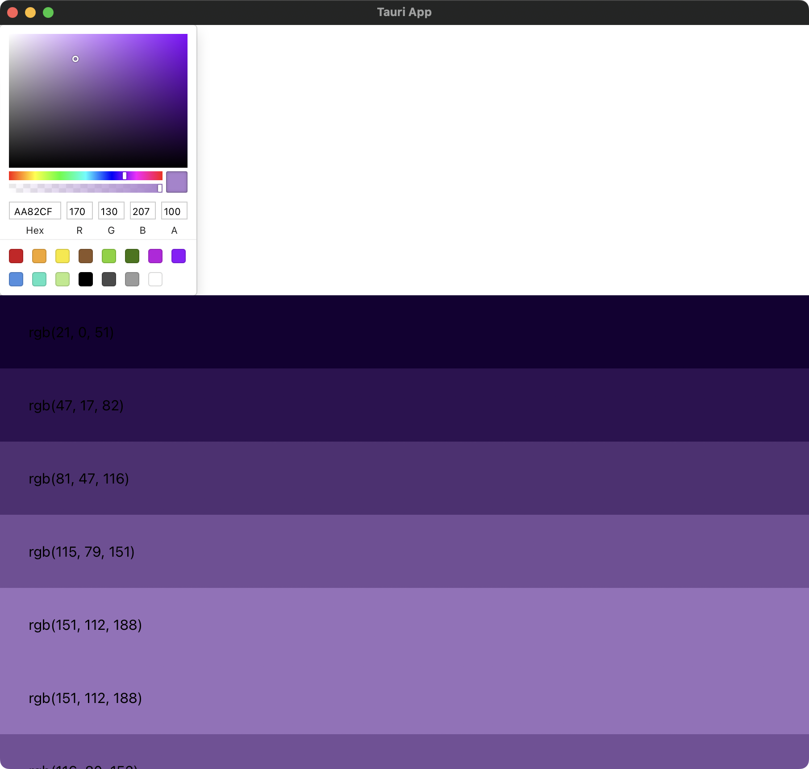

# Tauri Color Picker App
This repository is an example Tauri application of Color Picker and Grandient display, which is based on the YouTube tutorial [here](https://www.youtube.com/watch?v=zawhqLA7N9Y) (Thanks, Chris).

### Install necessary tools for Tauri

Please refer to the [Tauri official documentation](https://tauri.studio/docs/getting-started/prerequisites).

### Versions of the tools

Although similar versions would work, but my test was done with the following versions of tools.

* Node.js: `v8.1.0`
* npm: `v18.1.0`
* rustc: ` 1.60.0`

### Install `npm` packages

```
npm install
```

### Run the app

```
npm run tauri dev
```

After running the app you should be able to see something like below:


